# 🌐 Holberton School Network

<div align="center">


**A comprehensive collection of network fundamentals and practical exercises**

[📚 Explore the Modules](#-modules) • [🚀 Getting Started](#-getting-started) • [🤝 Contributing](#-contributing)

</div>

---

## 📋 Overview

This repository contains a complete curriculum for network fundamentals as part of the **Holberton School** program. It covers essential networking concepts from basic theory to practical implementation, progressing through foundational knowledge to advanced network configuration and troubleshooting.

The curriculum is designed to provide hands-on experience with network protocols, tools, and real-world scenarios that every software engineer and system administrator should understand.

## 📑 Table of Contents

- [🌐 Holberton School Network](#-holberton-school-network)
  - [📋 Overview](#-overview)
  - [📑 Table of Contents](#-table-of-contents)
  - [🎯 Learning Path](#-learning-path)
  - [📚 Modules](#-modules)
    - [🔰 Network Basics 0](#-network-basics-0)
    - [⚙️ Network Basics 1](#️-network-basics-1)
  - [📊 Repository Structure](#-repository-structure)
  - [🚀 Getting Started](#-getting-started)
    - [📋 Prerequisites](#-prerequisites)
    - [🛠️ Installation](#️-installation)
    - [🏃‍♂️ Quick Start](#️-quick-start)
  - [💡 Key Concepts Covered](#-key-concepts-covered)
  - [🛠️ Tools and Technologies](#️-tools-and-technologies)
  - [🧪 Testing](#-testing)
  - [📈 Progress Tracking](#-progress-tracking)
  - [🎓 Learning Objectives](#-learning-objectives)
  - [🛡️ Best Practices](#️-best-practices)
  - [🔧 Troubleshooting](#-troubleshooting)
  - [🤝 Contributing](#-contributing)
  - [📚 Additional Resources](#-additional-resources)
  - [👥 Community](#-community)
  - [📄 License](#-license)
  - [👨‍💻 Authors](#-authors)
  - [🙏 Acknowledgments](#-acknowledgments)

---

## 🎯 Learning Path

```mermaid
graph TD
    A[🔰 Network Basics 0] --> B[⚙️ Network Basics 1]
    A --> C[📚 Theoretical Foundations]
    B --> D[🛠️ Practical Applications]
    C --> E[🌐 OSI Model]
    C --> F[🏠 Network Types]
    C --> G[📍 Addressing Systems]
    D --> H[🔧 Configuration Scripts]
    D --> I[🧪 Network Testing]
    D --> J[🔍 Troubleshooting Tools]
```



## 📚 Modules

### 🔰 Network Basics 0
**Directory**: [`basics_0/`](./basics_0/)

**Focus**: Foundational networking theory and concepts

#### 📖 Contents:
- **0-OSI_model** - Understanding the 7-layer networking model
- **1-types_of_network** - LAN, WAN, and Internet classifications
- **2-MAC_and_IP_address** - Hardware vs logical addressing
- **3-UDP_and_TCP** - Transport protocol characteristics
- **4-TCP_and_UDP_ports** - Port monitoring and analysis
- **5-is_the_host_on_the_network** - Network connectivity testing

#### 🎯 Skills Developed:
- OSI model comprehension
- Network topology understanding
- Protocol analysis
- Basic network troubleshooting
- Command-line network tools

---

### ⚙️ Network Basics 1
**Directory**: [`basics_1/`](./basics_1/)

**Focus**: Network configuration and advanced troubleshooting

#### 📖 Contents:
- **0-change_your_home_IP** - DNS resolution configuration
- **1-show_attached_IPs** - Network interface discovery
- **2-port_listening_on_localhost** - Local network services

#### 🎯 Skills Developed:
- DNS configuration and management
- System network interface analysis
- Local service configuration
- Advanced Bash scripting for networking
- Security-conscious network modifications

---

## 📊 Repository Structure

```
holbertonschool-network/
├── 📄 README.md                    # Main repository documentation
├── 📁 basics_0/                    # Fundamental networking concepts
│   ├── 📄 README.md                # Module 0 documentation
│   ├── 📝 0-OSI_model              # OSI model questions
│   ├── 📝 1-types_of_network       # Network classification
│   ├── 📝 2-MAC_and_IP_address     # Addressing systems
│   ├── 📝 3-UDP_and_TCP            # Transport protocols
│   ├── 🔧 4-TCP_and_UDP_ports      # Port monitoring script
│   └── 🔧 5-is_the_host_on_the_network # Connectivity testing
└── 📁 basics_1/                    # Advanced network configuration
    ├── 📄 README.md                # Module 1 documentation
    ├── 🔧 0-change_your_home_IP    # DNS configuration script
    ├── 🔧 1-show_attached_IPs      # Interface discovery script
    └── 🔧 2-port_listening_on_localhost # Local service script
```

**File Types Legend:**
- 📝 **Theory Files**: Text files containing answers to conceptual questions
- 🔧 **Executable Scripts**: Bash scripts for practical network operations
- 📄 **Documentation**: Comprehensive README files with explanations

---

## 🚀 Getting Started

### 📋 Prerequisites

**System Requirements:**
- **OS**: Ubuntu 20.04+ (primary) or macOS (compatible)
- **Shell**: Bash 4.0+
- **Network**: Internet connection for testing
- **Privileges**: Root access for system-level operations

**Knowledge Prerequisites:**
- Basic Linux/Unix command line
- Understanding of file permissions
- Familiarity with text editors (nano, vim, etc.)

### 🛠️ Installation

1. **Clone the Repository**
   ```bash
   git clone https://github.com/hector17rock/holbertonschool-network.git
   cd holbertonschool-network
   ```

2. **Set Up Permissions**
   ```bash
   # Make all scripts executable
   find . -name "*.sh" -o -name "*TCP*" -o -name "*network*" -o -name "*IP*" | xargs chmod +x
   
   # Or individually:
   chmod +x basics_0/4-TCP_and_UDP_ports
   chmod +x basics_0/5-is_the_host_on_the_network
   chmod +x basics_1/0-change_your_home_IP
   chmod +x basics_1/1-show_attached_IPs
   chmod +x basics_1/2-port_listening_on_localhost
   ```

3. **Install Required Tools**
   ```bash
   # Ubuntu/Debian
   sudo apt update
   sudo apt install net-tools netcat-openbsd curl
   
   # macOS
   brew install netcat
   ```

### 🏃‍♂️ Quick Start

1. **Start with Theory** (Module 0):
   ```bash
   cd basics_0
   cat README.md  # Read the comprehensive guide
   ```

2. **Test Your Knowledge**:
   ```bash
   # Check your theoretical understanding
   ./4-TCP_and_UDP_ports
   ./5-is_the_host_on_the_network 8.8.8.8
   ```

3. **Move to Practice** (Module 1):
   ```bash
   cd ../basics_1
   ./1-show_attached_IPs  # Discover your network interfaces
   ```

4. **Verify Learning**:
   ```bash
   # Run automated tests (if available)
   # Or manually verify outputs against expected results
   ```

---

## 💡 Key Concepts Covered

### 🔬 Theoretical Foundations
- **🏗️ OSI Model**: 7-layer networking architecture
- **🌍 Network Types**: LAN, WAN, Internet classifications
- **📧 Addressing**: MAC vs IP address systems
- **🚚 Transport Protocols**: TCP vs UDP characteristics
- **🚪 Port Management**: Service identification and monitoring

### ⚡ Practical Skills
- **🔧 DNS Configuration**: Custom domain resolution
- **📡 Network Discovery**: Interface and IP enumeration
- **🔍 Service Monitoring**: Port and process analysis
- **🧪 Connectivity Testing**: Network reachability verification
- **📜 Script Development**: Automated network operations

### 🛡️ Security Considerations
- **🔒 Safe DNS Modification**: Backup and restore procedures
- **👁️ Network Reconnaissance**: Ethical discovery techniques
- **🚫 Access Control**: Privilege management
- **📋 Audit Trails**: Logging and monitoring practices

---

## 🛠️ Tools and Technologies

### 🐧 Command Line Tools
| Tool | Purpose | Module |
|------|---------|--------|
| `netstat` | Port and connection monitoring | 0, 1 |
| `ping` | Network connectivity testing | 0 |
| `ifconfig` | Network interface configuration | 1 |
| `nc` (netcat) | Network communication | 1 |
| `grep`, `cut`, `sed` | Text processing | 0, 1 |

### 📝 Languages and Scripts
- **Bash**: Primary scripting language
- **Regular Expressions**: Pattern matching and text processing
- **System Commands**: Linux/Unix utilities integration

### 🔧 Network Protocols
- **ICMP**: Internet Control Message Protocol (ping)
- **TCP**: Transmission Control Protocol
- **UDP**: User Datagram Protocol
- **DNS**: Domain Name System
- **HTTP/HTTPS**: Web protocols

---

## 🧪 Testing

### 🤖 Automated Testing
The exercises are designed for automated grading systems that validate:
- ✅ Correct theoretical answers
- ✅ Script functionality and output format
- ✅ Error handling and edge cases
- ✅ Security best practices

### 🔍 Manual Verification

**Theory Validation:**
```bash
# Verify answer formats
for file in basics_0/*model basics_0/*network basics_0/*address basics_0/*TCP; do
    echo "=== $file ==="
    cat "$file"
    echo
done
```

**Script Testing:**
```bash
# Test all executable scripts
./basics_0/4-TCP_and_UDP_ports | head -5
./basics_0/5-is_the_host_on_the_network 127.0.0.1
./basics_1/1-show_attached_IPs
```

**Integration Testing:**
```bash
# Test complete workflows
./basics_1/0-change_your_home_IP  # Requires sudo
ping -c 1 localhost              # Verify DNS changes
```

---

## 📈 Progress Tracking

### 📊 Module Completion
- [ ] **Basics 0**: Foundational Theory
  - [ ] OSI Model Understanding
  - [ ] Network Types Classification
  - [ ] Address Systems Knowledge
  - [ ] Protocol Characteristics
  - [ ] Port Monitoring Skills
  - [ ] Connectivity Testing

- [ ] **Basics 1**: Practical Configuration
  - [ ] DNS Management
  - [ ] Interface Discovery
  - [ ] Service Configuration

### 🎯 Skill Development
- [ ] **Beginner**: Can explain basic networking concepts
- [ ] **Intermediate**: Can use command-line networking tools
- [ ] **Advanced**: Can write network diagnostic scripts
- [ ] **Expert**: Can troubleshoot complex network issues

---

## 🎓 Learning Objectives

By completing this curriculum, students will be able to:

### 🧠 Theoretical Understanding
1. **Explain** the OSI model and its seven layers
2. **Differentiate** between LAN, WAN, and Internet networks
3. **Compare** MAC and IP addressing systems
4. **Analyze** TCP vs UDP protocol characteristics
5. **Understand** port-based service identification

### 🔧 Practical Skills
1. **Monitor** network ports and active connections
2. **Test** network connectivity using ping
3. **Configure** custom DNS resolution
4. **Discover** network interfaces and IP addresses
5. **Create** local network services
6. **Write** Bash scripts for network automation

### 🛡️ Security Awareness
1. **Implement** safe network configuration changes
2. **Understand** the impact of DNS modifications
3. **Practice** responsible network reconnaissance
4. **Apply** principle of least privilege

---

## 🛡️ Best Practices

### 📚 For Students
1. **📖 Read Documentation**: Always read module READMEs thoroughly
2. **🧪 Test Safely**: Use isolated environments for potentially disruptive operations
3. **💾 Backup Configuration**: Always backup system files before modification
4. **🔍 Understand, Don't Memorize**: Focus on concepts rather than rote learning
5. **🤝 Collaborate**: Discuss concepts with peers to deepen understanding

### 👨‍🏫 For Instructors
1. **🎯 Emphasize Concepts**: Ensure students understand the "why" behind each exercise
2. **⚖️ Balance Theory and Practice**: Combine conceptual knowledge with hands-on experience
3. **🔐 Stress Security**: Always highlight security implications of network operations
4. **📊 Track Progress**: Monitor student understanding through both theory and practical assessments

---

## 🔧 Troubleshooting

### ❓ Common Issues

#### 🚫 Permission Denied
```bash
# Solution: Make scripts executable
chmod +x script_name
```

#### 🔍 Command Not Found
```bash
# Install missing tools
sudo apt install net-tools  # Ubuntu
brew install netcat         # macOS
```

#### 🌐 Network Access Issues
```bash
# Check network connectivity
ping -c 3 8.8.8.8
ifconfig  # Check interface status
```

#### 📝 Incorrect Answer Format
- Ensure files contain only required content (numbers for theory questions)
- Check for extra whitespace or special characters
- Verify line endings are appropriate for your system

### 🆘 Getting Help
1. **📖 Check Documentation**: Review module-specific README files
2. **🔍 Debug Step-by-Step**: Break down problems into smaller components
3. **🤝 Ask for Help**: Reach out to instructors or peers
4. **📝 Document Solutions**: Keep notes for future reference

---

## 🤝 Contributing

We welcome contributions to improve the curriculum! Here's how you can help:

### 🐛 Reporting Issues
- Use GitHub Issues to report bugs or suggest improvements
- Provide clear descriptions and steps to reproduce problems
- Include system information (OS, shell, tool versions)

### 💡 Suggesting Enhancements
- Propose new exercises or concepts to cover
- Suggest improvements to existing documentation
- Share alternative solutions or approaches

### 🔧 Code Contributions
1. Fork the repository
2. Create a feature branch: `git checkout -b feature/amazing-feature`
3. Commit changes: `git commit -m 'Add amazing feature'`
4. Push to branch: `git push origin feature/amazing-feature`
5. Open a Pull Request

### 📝 Documentation
- Improve existing documentation
- Add examples and use cases
- Translate content to other languages
- Create video tutorials or guides

---

## 📚 Additional Resources

### 📖 Books
- **"Computer Networking: A Top-Down Approach"** by Kurose & Ross
- **"TCP/IP Illustrated"** by W. Richard Stevens
- **"Network Warrior"** by Gary Donahue

### 🌐 Online Resources
- [Cisco Networking Academy](https://www.netacad.com/)
- [Professor Messer's Network+ Course](https://www.professormesser.com/)
- [PacketLife.net Cheat Sheets](https://packetlife.net/library/cheat-sheets/)
- [Wireshark Documentation](https://www.wireshark.org/docs/)

### 🛠️ Tools for Further Learning
- **Wireshark**: Network protocol analyzer
- **Nmap**: Network discovery and security auditing
- **GNS3**: Network simulation platform
- **Packet Tracer**: Cisco network simulation tool

### 📺 Video Resources
- [NetworkChuck YouTube Channel](https://www.youtube.com/c/NetworkChuck)
- [Practical Networking YouTube Channel](https://www.youtube.com/c/PracticalNetworking)

---

## 👥 Community

### 💬 Discussion Platforms
- **GitHub Discussions**: For project-related discussions
- **Stack Overflow**: For technical questions (tag: networking, bash)
- **Reddit**: r/networking, r/sysadmin communities

### 🏫 Holberton School Resources
- **Intranet**: Access school-specific resources and forums
- **Peer Learning**: Collaborate with classmates
- **Office Hours**: Schedule time with instructors

---

## 📄 License

This project is created for educational purposes as part of the Holberton School curriculum. All materials are intended for learning and should be used responsibly.

**Educational Use Only** - Please respect academic integrity policies when using these materials.

---

## 👨‍💻 Authors

<div align="center">

### 👨‍🎓 Student Developer
**Héctor Soto**
- GitHub: [@hector17rock](https://github.com/hector17rock)
- Role: Student, Script Developer, Documentation Author

### 🏫 Institution
**Holberton School**
- Curriculum Design and Educational Framework
- Network Fundamentals Program

</div>

---

## 🙏 Acknowledgments

- **Holberton School** for providing comprehensive networking curriculum
- **Open Source Community** for developing the tools used in this project
- **Network Professionals** who have shared knowledge and best practices
- **Fellow Students** who have contributed to collaborative learning
- **Instructors and Mentors** who have guided the learning process

---

<div align="center">

**📚 Happy Learning! 🌐**

*"The best way to learn networking is to do networking."*

[](https://github.com/hector17rock/holbertonschool-network/stargazers)
[](https://github.com/hector17rock/holbertonschool-network/network/members)

</div>
